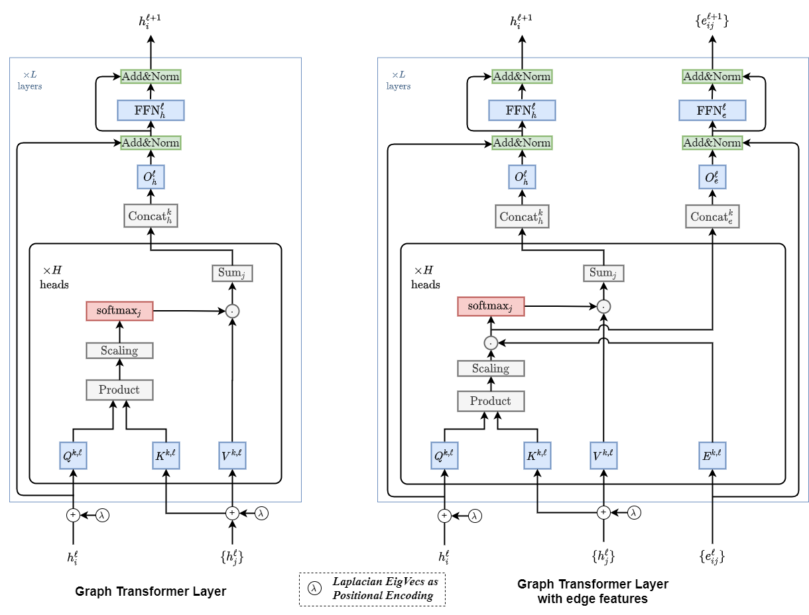

# Graph Transformer Architecture

Source code for the paper "**A Generalization of Transformer Networks to Graphs**" by _[Vijay Prakash Dwivedi](https://github.com/vijaydwivedi75) and [Xavier Bresson](https://github.com/xbresson)_, at **AAAI'21 Workshop on Deep Learning on Graphs: Methods and Applications (DLG-AAAI'21)**.

We propose a generalization of transformer neural network architecture for arbitrary graphs: **Graph Transformer**. <br>Compared to the [Standard Transformer](https://papers.nips.cc/paper/2017/file/3f5ee243547dee91fbd053c1c4a845aa-Paper.pdf), the highlights of the presented architecture are: 

- The attention mechanism is a function of neighborhood connectivity for each node in the graph.  
- The position encoding is represented by Laplacian eigenvectors, which naturally generalize the sinusoidal positional encodings often used in NLP.  
- The layer normalization is replaced by a batch normalization layer.  
- The architecture is extended to have edge representation, which can be critical to tasks with rich information on the edges, or pairwise interactions (such as bond types in molecules, or relationship type in KGs. etc). 

<br>

<p align="center">
  
  <br>
  <b>Figure</b>: Block Diagram of Graph Transformer Architecture
</p>


## 1. Repo installation

This project is based on the [benchmarking-gnns](https://github.com/graphdeeplearning/benchmarking-gnns) repository.

[Follow these instructions](./docs/01_benchmark_installation.md) to install the benchmark and setup the environment.


<br>

## 2. Download datasets

[Proceed as follows](./docs/02_download_datasets.md) to download the datasets used to evaluate Graph Transformer.


<br>

## 3. Reproducibility 

[Use this page](./docs/03_run_codes.md) to run the codes and reproduce the published results.


<br>

## 4. Reference 

Coming soon!

<!-- ```
@article{dwivedi2020graph,
  title={A Generalization of Transformer Networks to Graphs},
  author={Dwivedi, Vijay Prakash and and Bresson, Xavier},
  journal={arXiv preprint arXiv:2012.xxxxx},
  year={2020}
}
```
-->


<br><br><br>

